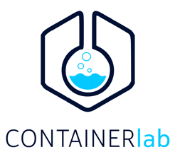

# Containerized testbeds for cellular mobile communications networks

<table align="center">
	<tr>
		<td></td>
		<td></td>
	</tr>
</table>

_All images and logos are property of their respective owners._

## _Containerlab_ scenarios

### 1.- Building Docker images.

You need to build the Docker images of all containers. Follow the following steps (assuming you have a terminal opened at this project's root directory):

```
# For UERANSIM containers:
$ cd docker/ueransim/
$ sudo docker build --no-cache -t giros-dit/ueransim:latest .

# For Open5GS containers:
$ cd docker/open5gs/
$ sudo docker build --no-cache -t giros-dit/open5gs:latest .

# For MongoDB container (subscriber database for Open5GS topologies):
$ cd docker/mongodb/
$ sudo docker build --no-cache -t giros-dit/mongodb:latest .
```

### 2.- Deploy testing scenarios.

In the `containerlab` directory there are several subdirectories with different testbed scenarios that can be used. Inside each subdirectory you can find the following:

- A `README` file with information and instructions about the scenario.
- A `conf` subdirectory with configuration files for each container that composes the scenario.
- A `topologies` subdirectory with _Containerlab_ topology definition files for the scenario.
- A `scripts` subdirectory with shell scripts for deploying/destroying/interacting with the scenario.

The number of available scenarios may increase with newer/different ones.

### 3.- Capturing traffic with Wireshark.

This command serves as a template to capture traffic with Wireshark in any container. You just need to replace `<clab-container-name>` with the desired _Containerlab_ container name and `<container-iface>` with the desired network interface inside the container.
The name of the container can be obtained right after deploying the topology. You must have Wireshark installed on your machine.

```
$ sudo ip netns exec <clab-container-name> tcpdump -l -nni <container-iface> -w - | wireshark -k -i -
```

