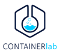
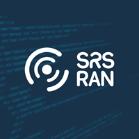

# _Containerlab_ testbeds for cellular mobile communications networks

## About

The main goal of this repository is to provide testbed scenarios for cellular mobile communications networks (e.g., LTE/4G/5G) using _Containerlab_ (based on _Docker_ containers).

While _Docker_ provides _Docker Compose_ for defining and deploying complex, multi-container scenarios, the networking part of it (inter-container connectivity) is arguably still a little bit complicated. Therefore, it is interesting to use other tools that simplify this task, so here is where _Containerlab_ comes into play. This tool provides an easy way of defining network topologies and scenarios by using a standard definition language (YAML). And by leveraging existent _Linux_ bridging and switching software, such as _Open vSwitch_, we can use it to define custom, modular scenarios that can be interconnected in a handful of different ways.

The idea is to provide different scenarios that can be used to deploy and test complete cellular networks. The core network is provided using _Containerlab_ topologies, and the RAN can be deployed using any simulated or _physical_ implementation. The scenarios can be interconnected, so it is possible to, for example, add an IMS and provide VoLTE, or extend the networks in any way you may imagine.

### Requisites

In order to run the scenarios, you need to have the following:
- A machine running either a native or virtualized 64-bit _Linux_ operating system with a fairly good amount of available RAM and storage.
	- Depending on your system limitations and the usage of your operating system, a good, minimum recommendation would be to have 16 GB of RAM and 128 GB of storage. However, a more limited system could also run these scenarios without issues.
	- Since the core functionality of the scenarios runs on _Docker_ containers, any _Linux_ distribution can be used. However, for maximum compatibility of libraries and dependencies we have used _Ubuntu 20.04 LTS_. You may want to use this or a newer version. Nevertheless, if you prefer another distribution, feel free to use it, but notice that the installation instructions for any library and dependency will vary.
	- If you use _Windows_ 10 or 11, _WSL2_ may work, but bear in mind that we haven't tested it.
- You can find the installation instructions for _Containerlab_ along with more documentation at this link: https://containerlab.dev/install/. This tool relies on _Docker_, so you must also install it on your machine.
- Some inter-container connectivity relies on _Open vSwitch_ bridges, so you must install it as well.
- The connectivity between _Containerlab_ topologies and between scenarios and the Internet is done via the `virbr0` bridge provided by the `libvirt` library, so you must install it.
- For traffic capturing, you need to install _Wireshark_ on your system.

### Featured implementations

| Implementation | Description |
|:-:|---|
|  | Tool for orchestrating and managing container-based networking laboratories. |
|  | Open source 3GPP Rel-17 compliant implementation of 4G-LTE EPC (Evolved Packet Core) and 5G Core. |
|  | Open source 3GPP compliant 4G-LTE and 5G software suites. |
|  | Open source 3GPP Rel-15 compliant implementation of 5G UE (User Equipment) and gNodeB simulation. |

<table align="left">
	<tr>
		<td><a href="https://containerlab.dev/"></a></td>
		<td>Tool for orchestrating and managing container-based networking laboratories.</td>
	</tr>
	<tr>
		<td><a href="https://open5gs.org"></a></td>
		<td>Open source 3GPP Rel-17 compliant implementation of 4G-LTE EPC (Evolved Packet Core) and 5G Core.</td>
	</tr>
	<tr>
		<td><a href="https://www.srslte.com/"></a></td>
		<td>Open source 3GPP compliant 4G-LTE and 5G software suites.</td>
	</tr>
	<tr>
		<td><a href="https://github.com/aligungr/UERANSIM"></a></td>
		<td>Open source 3GPP Rel-15 compliant implementation of 5G UE (User Equipment) and RAN (Radio Access Network) gNB simulation.</td>
	</tr>
</table>

## General instructions

### 1.- Building _Docker_ images

You need to build the _Docker_ images for all containers. Follow these steps (assuming you have a terminal opened at this project's root directory):

```
# For UERANSIM containers:
$ cd docker/ueransim/
$ sudo docker build --no-cache -t giros-dit/ueransim:latest .

# For srsRAN 4G (4G-LTE RAN) containers:
$ cd docker/srsran-4g/
$ sudo docker build --no-cache -t giros-dit/srsran-4g:latest .

# For srsRAN Project (5G RAN) containers:
$ cd docker/srsran-project/
$ sudo docker build --no-cache -t giros-dit/srsran-project:latest .

# For Open5GS containers:
$ cd docker/open5gs/
$ sudo docker build --no-cache -t giros-dit/open5gs:latest .

# For MongoDB container (Open5GS subscriber database):
$ cd docker/mongodb/
$ sudo docker build --no-cache -t giros-dit/mongodb:latest .
```

### 2.- Deploying scenarios

In the  directory there are several subdirectories with different testbed scenarios that can be used. Inside each subdirectory you can find the following structure:

- A `README` file with information and instructions about the scenario.
- A `conf` subdirectory with configuration files for each container that composes the scenario.
- A `topologies` subdirectory with _Containerlab_ topology definition files for the scenario.
- A `scripts` subdirectory with shell scripts for deploying/destroying/interacting with the scenario.

### 3.- Capturing traffic with _Wireshark_

This command serves as a template to capture traffic with _Wireshark_ in any container. You just need to replace `<clab-container-name>` with the desired _Containerlab_ container name and `<container-interface>` with the desired network interface inside the container.
The name of the container can be obtained right after deploying the topology.

```
$ sudo ip netns exec <clab-container-name> tcpdump -l -nni <container-interface> -w - | wireshark -k -i -
```

If the above command does not work, you can directly open Wireshark, select the desired container interface and start capturing traffic right away.

**NOTE:** It is recommended to enable all protocols under the `Analyze` -> `Enabled protocols` menu from the top bar.

### Other - SSH access to containers

You can SSH to the containers deployed in any scenario with the following set of credentials:
- Username: `root` - Password: `gprsumts`.
- Username: `admin` - Password: `admintelecom`.

## Disclaimer and acknowledgements
_All images and logos are property of their respective owners. Click over any logo to open the official project's webpage for further information and documentation._

Special thanks to every developer and contributor that made any featured implementation possible.
