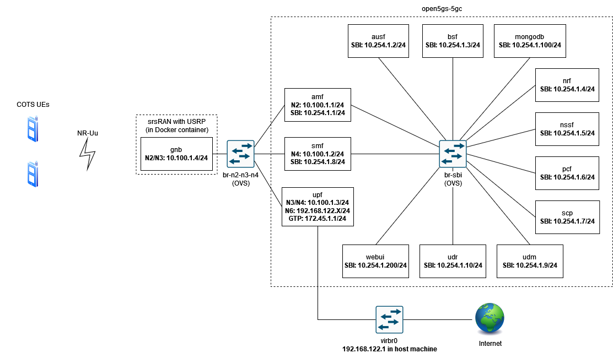

# 5G Standalone (5G SA) with _Open5GS_ and _srsRAN Project_ gNodeB

## Scenario diagram



## Deploying the scenario

```bash
$ cd scripts/
$ ./deploy.sh
```

## Work in Progress

## Destroying the scenario

```bash
$ cd scripts/
$ ./destroy.sh
```
