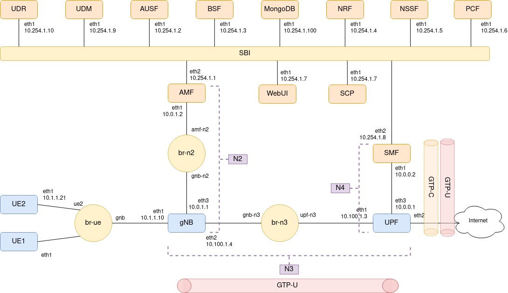

# 5G Standalone (5G SA) with _Open5GS_ and _UERANSIM_

## Scenario diagram



## Deploying the scenario

```
$ cd scripts/
$ ./deploy.sh
```

## Starting gNB and UE

In different terminal tabs or windows:

### gNB

```
$ cd scripts/
$ ./start-gnb.sh
```

### UE

```
$ cd scripts/
$ ./start-ue.sh
```

## Using UE's Internet connectivity

Open a new terminal tab or window and execute the following:

```
$ ssh -X admin@clab-ueransim-ue
```

Password is `admintelecom`.

Once logged in, execute the following command to launch an instance of Firefox attached to the GTP interface:

```
$ /UERANSIM/build/nr-binder 172.45.1.2 firefox
```

## Destroying the scenario

```
$ cd scripts/
$ ./destroy.sh
```
